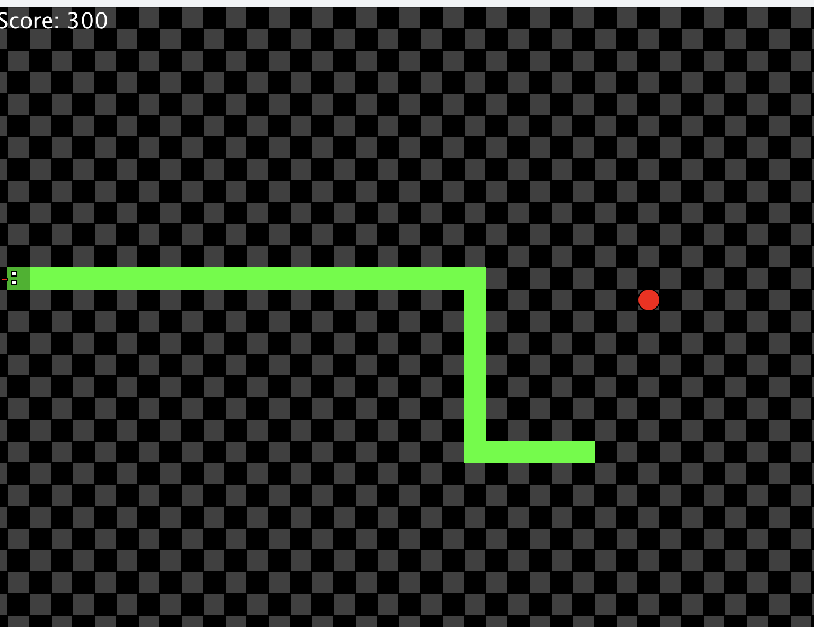
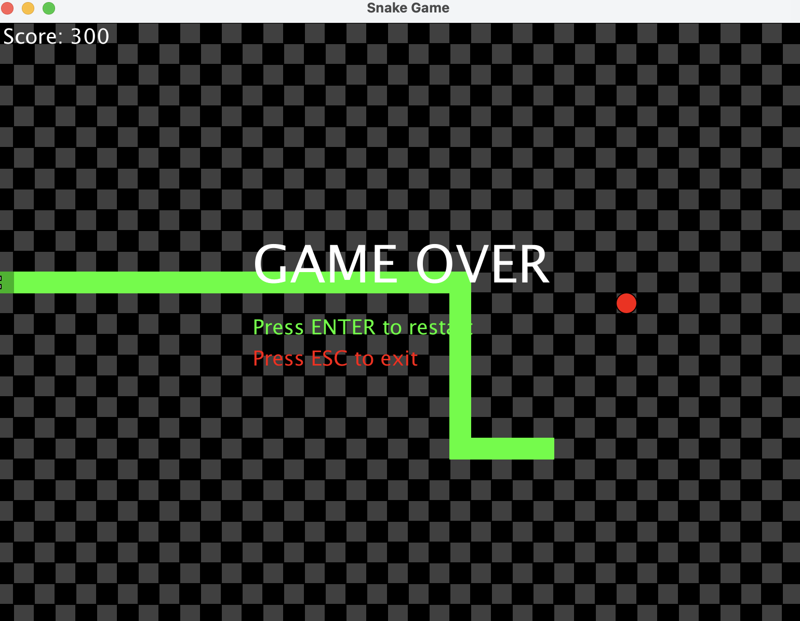

# Snake Game

## What is this repository about?

This repository contains the code for **Snake Game** a game built in Java using the Macalester Graphics Library for rendering and the Java Sound API for background music.

The player controls a snake on an 800×600 grid using the arrow keys. The goal is to eat red apples to earn points and grow longer. At score thresholds of 50 and 150, white obstacle blocks appear on the board, increasing the difficulty. The game ends if the snake hits a wall, runs into itself, or collides with an obstacle. After game over, the player can press **Enter** to restart or **Escape** to quit.

**Authors:** Munya, Thusa  

---

## Software Requirements

| Software | Minimum Version | Notes |
|----------|----------------|-------|
| **Java (OpenJDK)** | 17+ | [Download from Oracle](https://www.oracle.com/java/technologies/downloads/) or use [OpenJDK](https://openjdk.org/) |
| **VS Code** | 1.90+ | [Download from Microsoft](https://code.visualstudio.com/) |
| **Extension Pack for Java** | Latest | Install via VS Code Extensions (Microsoft) |
| **Macalester Graphics Library** | Included | JAR file should be in your project `lib/` folder or classpath |

**Note:** This project uses the Macalester Graphics Library (`edu.macalester.graphics`). Make sure the library JAR is added to your project's build path / classpath before compiling.

---

## Setup & Installation Steps

Follow these steps to prepare your machine and run the game:

### 1. Clone the repository

    git clone https://github.com/mac-comp127-s26/project-munya-thusa-project.git
    cd project-munya-thusa-project

### 2. Ensure Java is installed

Verify your Java version in the terminal:

    java -version

You should see output like `openjdk 21.0.x` or higher. If not, install the JDK.

### 3. Open the project in VS Code

### 4. Add the Macalester Graphics Library to your classpath

- If your course provided a `lib/` folder with `macalestergraphics.jar`, make sure it is in the project root or a `lib/` folder.
- In VS Code, press **Ctrl+Shift+P** (or **Cmd+Shift+P** on Mac), type **"Java: Configure Classpath"**, and add the JAR file.

### 5. Add the music file

The game expects a music file at:

    res/music.wav

Ensure the `res/` folder exists in your project root and contains `music.wav`. If the file is missing, the game will still run but will print `"Could not load music"` to the console.

### 6. Compile and run

Open `SnakeGame.java` and click the **Run** button (▶) in VS Code, 

On Windows, replace the colon `:` with a semicolon `;` in the classpath.

---

## Expected Output

When you run `SnakeGame.java`, an 800×600 window titled **"Snake Game"** opens with the following features:

- **Checkerboard background** (alternating black and dark gray tiles)
- **Green snake** with a custom animated head (eyes and tongue that change direction)
- **Red apple** that respawns randomly when eaten
- **Score display** in the top-left corner
- **Background music** looping continuously
- **White obstacles** that appear at score 50 and double at score 150

### Screenshots

---

## Presentation Video

A walkthrough video demonstrating gameplay, features, and code structure is available in the repository:

   <iframe src="https://drive.google.com/file/d/1I9EsOtEXpARspnHIelAz0snnSIcVm3yr/preview" width="640" height="480"></iframe>

---

## Presentation Slides

The project presentation slides are available here:

  <iframe src="https://docs.google.com/presentation/d/e/2PACX-1vT9aJ3XvyPdbKXFKRn0xFAp1xN9SIvxUpln0zLZWd28mmiDxsc34ICblCJ0PW3dO43VB47KkZ2wZ-SH/embed?start=false&loop=false&delayms=3000" width="960" height="569" frameborder="0" allowfullscreen="true" mozallowfullscreen="true" webkitallowfullscreen="true"></iframe>

---

## How We Could Expand the Game

- **Levels & maps:** Multiple grid layouts with pre-placed walls and increasing difficulty.
- **Multiplayer:** Two-player local or online competitive modes.
- **Power-ups:** Temporary boosts like speed, invincibility, score multipliers, or tail shrink.
- **High-score saving:** Persist best scores across sessions in a local file.
- **Better animations:** Smooth movement, death effects, and apple-eating visual feedback.
- **Skins & themes:** Swap color palettes or sprites (neon, retro, nature).
- **Pause menu:** Freeze gameplay with resume, restart, and quit options.
- **Leaderboard:** Rank players by top scores from saved data.

---

## Resources Referenced

The following resources were consulted during development:

| Resource | Purpose |
|----------|---------|
| **Macalester Graphics Library** | Canvas, shapes, animation loop, and keyboard input handling |
| **Stack Overflow** — [How can I play sound in Java?](https://stackoverflow.com/questions/26305/how-can-i-play-sound-in-java) | Implementation of background music using `javax.sound.sampled` |
| **Oracle Java Documentation** — [`javax.sound.sampled` Package Summary](https://docs.oracle.com/javase/8/docs/api/javax/sound/sampled/package-summary.html) | Official API reference for `Clip`, `AudioSystem`, and `AudioInputStream` |
| **Java SE Documentation** | General Java syntax, `ArrayList`, `Random`, and `Color` API usage |

---

## Project Structure

    project-munya-thusa-project/
    │
    ├── SnakeGame.java       # Entry point — launches the game
    ├── Game.java            # Main game loop, rendering, input handling, score
    ├── Snake.java           # Snake movement, growth, collision, head animation
    ├── Apple.java           # Apple spawning and relocation
    ├── Obstacle.java        # Wall blocks that appear at score thresholds
    ├── Music.java           # Background music playback via Java Sound API
    │
    ├── res/                 # Screenshots, media, and game assets
       ├── FinalProduct.png
       ├── FinalProd.png
       ├── Video.mp4
       └── music.wav
    
   

